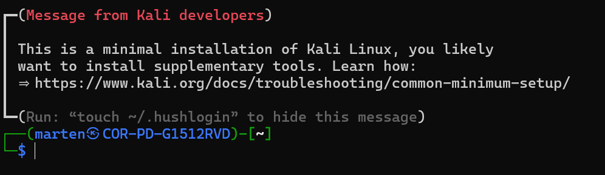

# WSL Installeren
In deze handleiding installeren we het Linux-besturingssysteem op je computer met behulp van WSL.

## PowerShell-commando's
Zoek op je computer naar `Windows Powershell` en kies ervoor om deze als administrator uit te voeren.

Kopieer het volgende commando, plak het in PowerShell en druk op Enter.

```powershell
dism.exe /online /enable-feature /featurename:Microsoft-Windows-Subsystem-Linux /all /norestart
```

Kopieer het volgende commando en plak deze in Powershell. Druk daarna op Enter.

```powershell
dism.exe /online /enable-feature /featurename:VirtualMachinePlatform /all /norestart
```

## Herstart je computer
Start je computer opnieuw op.

## Open Powershell opnieuw
Zoek op je computer naar `Windows Powershell` en kies ervoor om deze als administrator uit te voeren.

## Controleren of de instellingen goed staan

Voer het volgende commando uit in Windows Powershell

```powershell
wsl --status
```

Als het goed is, zie je het volgende verschijnen in Windows Powershell:

```
Standaardversie: 2
```

Mocht je dit niet zien, kan het zijn dat WSL nog niet geïnstalleerd is op je computer. Draai dan het volgende commando:

```powershell
wsl.exe --install
```

## Installeer Linux
Open wederom `Windows Powershell` en kies ervoor om deze als administrator uit te voerne.
Met het volgende commando zou je Linux moeten kunnen installeren op je computer.

```
wsl --install kali-linux
```
Tips:
1. Als je gevraagd wordt om je wachtwoord te typen, zie je in Linux geen sterretjes of iets anders, maar wat je typt wordt wel onthouden als je wachtwoord.
2. Je wordt bij het installeren gevraagd om `een gebruikersnaam` en `wachtwoord`. Onthoud deze!

## Controleren of de installatie gelukt is
Open `Windows Powershell` en typ het volgende commando:

```powershell
wsl -d kali-linux
```

Als het goed is zie je een afbeelding die erg lijkt op degene hieronder:

